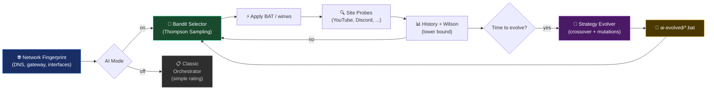

<div align="center">

<picture>
    <source media="(prefers-color-scheme: dark)" srcset="./assets/FluxRoute-white.svg">
    <source media="(prefers-color-scheme: light)" srcset="./assets/FluxRoute-dark.svg">
    
</picture>

# [FluxRoute AI](https://github.com/mx57/FluxRoute_AI)

**Language:** [🇷🇺 Русский](README.md) | 🇬🇧 English

### ⚡ Smart automation for zapret profile switching with self-learning AI

⭐️ **Star this repository — it's the best free way to support the project!**

**Fork Author:** [mx57](https://github.com/mx57) · [📥 Releases](https://github.com/mx57/FluxRoute_AI/releases) · [🐛 Issues](https://github.com/mx57/FluxRoute_AI/issues)

<p align="center">
    <a href="https://github.com/mx57/FluxRoute_AI"></a>
    <a href="https://github.com/mx57/FluxRoute_AI/releases"></a>
    <a href="https://github.com/mx57/FluxRoute_AI/releases"></a>
    <a href="https://dotnet.microsoft.com/"></a>
    <a href="./LICENSE"></a>
</p>

</div>

---

> **Original project:** [klondike0x/FluxRoute](https://github.com/klondike0x/FluxRoute)
>
> This fork is based on FluxRoute Desktop and extends it with additional
> AI features. Changes made by mx57 in 2026.

**FluxRoute AI** — an extension of the original [FluxRoute Desktop](https://github.com/klondike0x/FluxRoute) with a unique **self-learning AI subsystem** based on Thompson Sampling and genetic strategy evolution.

AI does not replace zapret — it **decides which BAT profile to run**, learns per network, and **generates new variants** from successful configurations.

---

## ✨ Unique AI Features (in this fork)

| Feature | Description |
|---------|-------------|
| 🧠 **AI Orchestrator** | Thompson Sampling for self-learning strategy selection tailored to your network |
| 🧬 **Genetic Evolution** | Crossover of top strategies + zapret parameter mutations → new BATs in `engine/ai-evolved/` |
| 🌐 **Network Fingerprint** | Adapts AI policy per network (Wi-Fi ↔ Ethernet, different DNS) |
| 🎰 **Bandit Selector** | Strategy selection via Thompson Sampling with configurable exploration (‰) |
| 📊 **Wilson Scoring** | Strategy ranking by Wilson lower bound for reliable prioritization |
| 💾 **Per-network Policy Memory** | Persists learned strategies per network |

### Core Features (from original FluxRoute)

- **Convenient GUI** instead of manually launching BAT files
- **Automatic `engine/` updates** from GitHub Releases
- **Profile Orchestrator** — tests connectivity and switches to the best option on failure
- **TG WS Proxy** — additional proxy channel integrated into the launch workflow
- **Hidden launch** of BAT files and `winws.exe` without extra console windows
- **Diagnostics and logs** always available without jumping between windows

---

## 🧠 AI Orchestrator

The `FluxRoute.AI` module adds an adaptive strategy engine on top of the regular orchestrator:

| Component | Purpose |
|-----------|---------|
| **Strategy Genome** | Typed strategy representation (filters, desync, split, fake TLS, etc.) parsed from BAT files |
| **Bandit Selector** | Thompson Sampling strategy pick with configurable exploration (‰) |
| **Strategy Evolver** | Crosses top genomes by Wilson lower bound; mutates zapret parameters |
| **Network Fingerprint** | Network signature (DNS, gateway, interfaces) — separate policy per network |
| **AiHistoryStore** | Probe log in `fluxroute-ai-history.jsonl` |
| **AiStrategyRegistry** | Genome registry, bandit state, generation counter |
| **BatMaterializer** | Writes evolved strategies to `engine/ai-evolved/*.bat` |

### How the AI Orchestrator Works



> 💡 The base AI orchestrator algorithm is described in the original [FluxRoute](https://github.com/klondike0x/FluxRoute).
> This fork extends it with additional strategy evolution capabilities.

### Workflow

1. 🌐 **Network Fingerprint** — capture DNS, gateway, interfaces
2. 🎰 **Bandit Selector** — pick a strategy via Thompson Sampling
3. ⚡ **Apply BAT** — launch `winws.exe` with strategy parameters
4. 🔍 **Site Probes** — check YouTube, Discord, etc. availability
5. 📊 **History + Wilson** — update success statistics
6. 🧬 **Evolution** — periodically crossover the best strategies
7. 📁 **`ai-evolved/`** — new BAT files are saved automatically

### AI Controls (Orchestrator Tab)

| Control | Description |
|---------|-------------|
| Enable self-learning selection | Orchestrator uses AI instead of simple profile ranking |
| Exploration (‰) | Share of "explore rare strategies" (default `100` = 10%) |
| Network / Generation / Probes | Current fingerprint, evolution generation, history record count |
| ⚗ Evolve now | Force evolution and refresh the strategy list |
| ↺ Reset model | Clear registry, bandit state, and probe history |
| 📁 ai-evolved | Open the folder with generated BAT files |
| Strategy list | Name, origin (builtin / evolved), Wilson score, last verification |

### First Launch with AI

1. Update `engine/` on the **Updates** tab
2. Enable **AI mode** on the **AI** tab
3. On **Orchestrator**, set test sites and click **Start orchestrator**
4. Wait for several check cycles — Wilson scores appear in the strategy list
5. Optionally click **Evolve now** — new BAT files land in `engine/ai-evolved/`

### AI Parameters

| Parameter | Default | Meaning |
|-----------|:-------:|---------|
| `Enabled` | `false` | AI mode in the UI |
| `ExplorationRatePermil` | `100` | Exploration in permille (‰) |
| `MaxEvolvedStrategies` | `24` | Cap on evolved strategies |
| `EvolutionIntervalMinutes` | `60` | Minimum auto-evolution interval |
| `MinProbesBeforeEvolve` | `6` | Probes before first auto-evolution |
| `KeepHistoryDays` | `14` | Probe history retention |

### AI Files

Next to app settings (`%AppData%` / local config):
- `fluxroute-ai-strategies.json` — genome registry and bandit state
- `fluxroute-ai-history.jsonl` — probe journal (network, genome, score, time)

Evolved profiles on disk: `engine/ai-evolved/`

---

## 🚀 Quick Start

### Requirements

- **Windows 10/11 x64**
- **Administrator privileges** (for `winws.exe` and WinDivert)

### Installation

1. Download the latest release: [**Releases**](https://github.com/mx57/FluxRoute_AI/releases)
2. Extract the ZIP archive to any convenient folder (e.g., `C:\FluxRoute_AI\`)
3. Run `FluxRoute.exe` **as Administrator**
4. Wait for automatic `engine/` download from Flowseal
5. Select a profile and click **▶ Start**

### First Launch with AI

1. Update `engine/` on the **Updates** tab
2. Enable **AI mode** on the **AI** tab
3. Start the **orchestrator** on the **Orchestrator** tab
4. Done — AI automatically selects the best strategy for your network

---

## 📸 Interface

<table>
<tr>
<td></td>
<td></td>
</tr>
<tr>
<td></td>
<td></td>
</tr>
</table>

---

## ⚠️ WinDivert and Antiviruses

> [!WARNING]
> The project uses **WinDivert** — a legitimate traffic interception tool required for zapret to work.
>
> It is **not a virus** by itself, but antiviruses may classify it as `Not-a-virus:RiskTool.Multi.WinDivert` or `HackTool`.

**What to do:**

- Add the FluxRoute AI folder to your **antivirus exclusions**
- Disable **PUA** (Potentially Unwanted Application) detection
- In Kaspersky: uncheck *"Detect legal applications that attackers often use"*

---

## 🛠 For Developers

### Requirements

- .NET 10 SDK
- Visual Studio 2022/2026 or JetBrains Rider

### Building from Source

```bash
git clone https://github.com/mx57/FluxRoute_AI.git
cd FluxRoute_AI
dotnet build
dotnet run --project FluxRoute
```

### Project Structure

```
FluxRoute_AI/
├── FluxRoute/              — UI (WPF, Views, ViewModels, AI tab)
├── FluxRoute.Core/         — Orchestrator, connectivity checks, AiSettings
├── FluxRoute.AI/           — AI engine (bandit, evolver, fingerprint, registry)
├── FluxRoute.Core.Tests/   — Unit tests (bandit, evolver, parser, fingerprint)
├── FluxRoute.Updater/      — Automatic engine updates from GitHub
└── engine/                 — Flowseal scripts (downloaded automatically)
    └── ai-evolved/         — BAT strategies created by evolution
```

### Contributing

1. Fork the repository
2. Create a branch: `git checkout -b feature/my-feature`
3. Commit: `git commit -m "feat: add my feature"`
4. Push: `git push origin feature/my-feature`
5. Open a **Pull Request**

---

## 🙏 Acknowledgments

This project would not be possible without:

- **[klondike0x/FluxRoute](https://github.com/klondike0x/FluxRoute)** — the original project this fork is based on. Special thanks to @klondike0x for the excellent architecture and integrating AI PR #19 into v1.5.0
- **[Flowseal/zapret-discord-youtube](https://github.com/Flowseal/zapret-discord-youtube)** — the `engine/` base
- **[Flowseal/tg-ws-proxy](https://github.com/Flowseal/tg-ws-proxy)** — Telegram WebSocket proxy
- **[bol-van/zapret](https://github.com/bol-van/zapret)** — the original zapret project
- **[bol-van/zapret-win-bundle](https://github.com/bol-van/zapret-win-bundle)** — Windows bundle with `winws.exe`
- **[WinDivert](https://github.com/basil00/WinDivert)** — low-level Windows foundation

### Projects That Inspired

- **[Zapret-GUI](https://github.com/medvedeff-true/Zapret-GUI)** — by `medvedeff-true`
- **[ZapretControl](https://github.com/Virenbar/ZapretControl)** — by `Virenbar`
- **[Zapret-Hub](https://github.com/goshkow/Zapret-Hub)** — by `goshkow`

---

## 📜 License

This project is distributed under the **GNU General Public License v3.0**.

See the [LICENSE](LICENSE) file for details.

**FluxRoute AI** is a **fork** of the [klondike0x/FluxRoute](https://github.com/klondike0x/FluxRoute) project with additional AI extensions.

All rights to `zapret`, `winws.exe`, and related scripts belong to their respective authors.
This repository does not claim authorship of the original low-level networking components.

---

<div align="center">

**Made with ❤️ based on [FluxRoute](https://github.com/klondike0x/FluxRoute)** · Fork Author: [mx57](https://github.com/mx57) · [⭐ Star this repo](https://github.com/mx57/FluxRoute_AI) · [🐛 Report a bug](https://github.com/mx57/FluxRoute_AI/issues)

</div>
