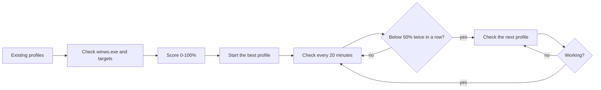
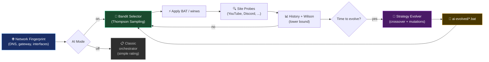

<div align="center">

<picture>
    <source media="(prefers-color-scheme: dark)" srcset="./assets/FluxRoute-white.svg">
    <source media="(prefers-color-scheme: light)" srcset="./assets/FluxRoute-dark.svg">
    
</picture>

# [FluxRoute Desktop](https://github.com/klondike0x/FluxRoute)

**Language:** [🇷🇺 Русский](README.md) | 🇬🇧 English

### Windows GUI with **self-learning AI orchestrator** for Flowseal zapret profiles

⭐️ **Star this repository — it's the best free way to support the project!**

<!-- GitHub badge -->
[](https://donatr.ee/klondike0x)

**Author:** [klondike0x](https://github.com/klondike0x) · [📚 Documentation](docs/index.md) · [📥 Releases](https://github.com/klondike0x/FluxRoute/releases) · [🐛 Issues](https://github.com/klondike0x/FluxRoute/issues) · [💬 Discussions](https://github.com/klondike0x/FluxRoute/discussions)

<p align="center">
    <a href="https://github.com/klondike0x/FluxRoute"></a>
    <a href="https://github.com/klondike0x/FluxRoute"></a>
    <a href="https://github.com/klondike0x/FluxRoute/actions/workflows/release.yml"></a>
    <a href="https://dotnet.microsoft.com/"></a>
    <a href="https://github.com/klondike0x/FluxRoute/releases"></a>
    <a href="https://github.com/klondike0x/FluxRoute/releases"></a>
    <a href="./LICENSE"></a>
</p>

</div>

---

> [!IMPORTANT]
> **This is the official FluxRoute Desktop repository.**
>
> Forks are permitted under GPL-3.0-or-later, but they are not official FluxRoute builds and may contain their own changes.

> [!CAUTION]
> ### ⚠️ Beware: Unofficial Copies
>
> **The only official source of FluxRoute is [this repository](https://github.com/klondike0x/FluxRoute).**
>
> If you downloaded the program from elsewhere, be cautious. Unofficial builds may contain:
> - ⚠️ Outdated code without current fixes
> - ⚠️ Unverified changes or additional telemetry
> - ⚠️ GPL-3.0-or-later violations, such as removed attribution
> - ⚠️ Unstable or unverified versions
>
> **How to protect yourself:**
> - ✅ Always check the source: `github.com/klondike0x/FluxRoute`
> - ✅ Download files only from the official [releases](https://github.com/klondike0x/FluxRoute/releases)
> - ✅ Use the SHA-256 manifest and GPG signature published with the release to check integrity
> - ✅ If a copy removes attribution, impersonates the official project, or contains suspicious changes — report it to the project maintainers
>
> The official FluxRoute build contains no intentional user telemetry. This statement does not cover third-party builds.

**FluxRoute Desktop** is a modern GUI wrapper for managing [`Flowseal/zapret-discord-youtube`](https://github.com/Flowseal/zapret-discord-youtube) profiles with a **self-learning AI orchestrator** powered by Thompson Sampling and genetic strategy evolution.

Launch, update, and switch profiles from a single window — no manual BAT-file editing required.

> 🌍 **Note:** FluxRoute is part of the **zapret ecosystem** — a set of tools for DPI (Deep Packet Inspection) bypass, primarily used in CIS countries to access blocked services like YouTube, Discord, Instagram, and Telegram. The main community is Russian-speaking, but the tool itself works anywhere DPI-based filtering is used.

## 📚 Contents

- [Features](#-features)
- [How FluxRoute Compares to Other GUIs](#-how-fluxroute-compares-to-other-guis)
- [Quick Start](#-quick-start)
- [Orchestrator](#-orchestrator)
- [AI Orchestrator](#-ai-orchestrator)
- [Auto-Tune](#-auto-tune)
- [Mods](#-mods)
- [Interface](#-interface)
- [Troubleshooting](#-troubleshooting)
- [Known Limitations](#-known-limitations)
- [WinDivert and Antivirus](#-windivert-and-antivirus)
- [Security](#-security)
- [Ecosystem](#-ecosystem)
- [For Developers](#-for-developers)
- [Copyright and Terms of Use](#-copyright-and-terms-of-use)
- [Acknowledgments](#-acknowledgments)
- [License](#-license)

---

## ✨ Features

### 🧠 Intelligence & Automation

| Feature | Description |
|---------|-------------|
| 🎯 **AI Orchestrator** | Thompson Sampling for self-learning strategy selection tailored to your network |
| 🧬 **Genetic Evolution** | Crossover of top strategies + zapret parameter mutations → new BATs in `engine/ai-evolved/` |
| 🌐 **Network Fingerprint** | Adapts AI policy per network (Wi-Fi ↔ Ethernet, different DNS) |
| 📊 **Classic Orchestrator** | Scans all profiles, rates 0-100%, auto-switches to the best on failure |
| ⚙️ **Auto-Tune** | Automatically finds the optimal IPSet × GameFilter combination |
| 🎮 **Process Triggers** | Auto-switches presets when games/apps launch (e.g., `rocketleague.exe`) |

### 🔌 Integrations

| Feature | Description |
|---------|-------------|
| 📡 **TG WS Proxy** | Built-in C# Telegram WebSocket proxy; no Python or separate installation required |
| 🔄 **Auto-update engine/** | Checks new Flowseal releases via GitHub Releases Atom feed (no API limits) |
| 🆙 **App auto-update** | Downloads and atomically installs new FluxRoute versions with SHA-256 verification |
| 🌍 **Domain Manager** | Add custom sites and exclusions for orchestrator checks via UI |

### 🎨 Interface

| Feature | Description |
|---------|-------------|
| 💎 **Compact UI** | Single Start/Stop button, status and logs always in view — no cluttered menus |
| 🖥 **Tray support** | Minimize to tray with balloon notifications |
| 🛡 **Hidden launch** | BAT files and `winws.exe` run in the background without console windows |
| 🚀 **Windows startup** | Registry autorun (`HKCU\...\Run`) with `--autostart` flag |
| ⚡ **Profile auto-launch** | Automatically starts the last used profile when FluxRoute launches |

### 🛡️ Security

| Feature | Description |
|---------|-------------|
| 🔒 **GitHub Actions** | Transparent CI/CD builds — every release compiled automatically from source |
| ✅ **SHA-256 verification** | Release hashes logged for integrity checks |
| ✍️ **GPG-signed releases** | The SHA-256 manifest is signed with a dedicated release key |
| 🔐 **Immutable Releases** | The workflow refuses to publish a release with an existing tag |
| 🧾 **Build provenance** | GitHub attestation links artifacts to the workflow and commit |
| 🔄 **Atomic updates** | Staging → backup → rollback on errors (no broken installations) |
| 👮 **Privilege handling** | UAC prompt when network protection needs elevation + clear error messages |

### 🔧 Diagnostics

| Feature | Description |
|---------|-------------|
| 📊 **Extended diagnostics** | Checks WinDivert, BFE, TCP timestamps, VPN, AdGuard, DNS, ISP |
| 💾 **Diagnostic bundle** | ZIP export with logs, settings, and system info for debugging; review its contents before sharing |
| 📋 **Real-time logs** | Logs tab with filtering, export, and history |
| 🌐 **Availability checks** | Tests YouTube, Discord, Google, Twitch, Instagram, Telegram, and more |

### 🎨 Ecosystem

| Feature | Description |
|---------|-------------|
| 📦 **Portable** | Runs from any folder, no installation required |
| 🧪 **Unit tests** | Coverage for bandit, evolver, parser, fingerprint |
| 📖 **Open source** | GPL-3.0-or-later — anyone can inspect what the app does |
| 🚫 **No telemetry** | FluxRoute does not collect user data |

---

## 🆚 How FluxRoute Compares to Other GUIs

FluxRoute is a GUI with a full-featured AI subsystem focused on automatic strategy selection and evolution:

| Category | FluxRoute | Zapret-Hub | Zapret-GUI | Zapret2 GUI | ZapretControl |
|---|:---:|:---:|:---:|:---:|:---:|
| 🧠 AI Orchestrator (Thompson Sampling) | ✅ | ❌ | ❌ | ❌ | ❌ |
| 🧬 Genetic Strategy Evolution | ✅ | ❌ | ❌ | ❌ | ❌ |
| 🔄 Orchestrator (auto-scanning) | ✅ | ✅ | ❌ | ✅ | ❌ |
| 🎮 Process-triggers (auto by .exe) | ✅ | ✅ | ❌ | ❌ | ❌ |
| ⚙️ Auto-Tune (IPSet × GameFilter) | ✅ | ✅ | ❌ | ❌ | ❌ |
| 📡 Built-in TG WS Proxy | ✅ | ✅ | ✅ | ❌ | ❌ |
| 🤖 AI DNS / DoH providers (Xbox, COMSS, dns.malw.link) | ✅ | ✅ | ✅ | ✅ | ❌ |
| 💬 Telegram Desktop Unlock | ✅ | ✅ | ✅ | ✅ | ❌ |
| 📚 80+ Strategies Out of the Box | ❌ | ❌ | ❌ | ✅ | ❌ |
| 🎨 Themes (5+) and Multilingual Support | ❌ | ✅ | ✅ | ❌ | ❌ |
| 📦 Portable + Installer | ✅ | ✅ | ⚠️ | ⚠️ | ⚠️ |
| 🔒 GitHub Actions (transparent build) | ✅ | ✅ | ❌ | ✅ | ✅ |
| 🔄 Atomic Engine Updates | ✅ | ⚠️ | ✅ | ❌ | ❌ |

> **Legend:** ✅ = fully implemented · ⚠️ = partial / with limitations · ❌ = not available

> **Key Difference:** FluxRoute automatically selects and evolves strategies for your network using Thompson Sampling and genetic algorithms. This table reflects the projects' stated capabilities when this README was last updated; check their current repositories before choosing a tool.

---

## 🚀 Quick Start

### Requirements

Full documentation: [📚 open documentation](docs/index.md).
- **Windows 10/11 x64**
- **Administrator privileges** may be required for `winws.exe` and WinDivert; the GUI itself can start without elevation

> **Fast path for most users:** download the latest official release, install or extract it to a writable folder, and run FluxRoute.exe. If network protection needs elevation, the app will request UAC. Then complete Onboarding and choose the services to check.

### Installation

1. Download the latest release: [**Releases**](https://github.com/klondike0x/FluxRoute/releases)
2. For the portable version, extract the ZIP to any folder (e.g., `C:\FluxRoute\`) or run the installer.
3. Run `FluxRoute.exe` normally. If WinDivert or `winws.exe` needs elevation, approve the UAC prompt.
4. If `engine/` is missing, wait for the automatic Flowseal download and restart FluxRoute. An internet connection is required.
5. In OnBoard, choose what to check: YouTube, Discord, or both services.
6. Click **“Configure and continue”** to scan strategies, or **“Continue without checking”** to open the app without the initial scan.

### First Launch with AI

1. Update `engine/` on the **Updates** tab
2. Enable **AI mode** on the **AI** tab
3. Launch the **orchestrator** on the **Orchestrator** tab
4. Done — AI will automatically pick the best strategy for your network

## 🎛️ Orchestrator

The classic orchestrator automatically selects the best profile from the strategies already available in FluxRoute. It works deterministically: it does not learn or create new strategies. Instead, it tests the available profiles, builds a ranking, and monitors the active connection.

### How it works

1. **Scan** — starts each profile in turn and checks winws.exe health and the availability of selected targets.
2. **Rank** — assigns every strategy a score from 0 to 100%.
3. **Start** — after scanning, starts the profile with the highest positive score.
4. **Monitor** — checks the active profile again at a configured interval (20 minutes by default).
5. **Fallback** — if the profile scores below 50% in two consecutive checks, the orchestrator tests the next profiles by rank and switches to the first working one.

### How the score is calculated

Maximum: 100 points:

- **20 points** — winws.exe is running.
- **15 points** — the process remains stable after startup.
- **Up to 55 points** — share of successful target checks.
- **Up to 10 points** — bonus for low average latency.
- If all checks fail or the process is unstable, additional limits and penalties apply.

Targets include built-in sites (YouTube, Discord, Google, Twitch, Instagram, and Telegram), plus custom targets added in settings. Profiles with a 0% score are excluded from normal selection.

### Workflow


```mermaid
flowchart LR
    A["Existing profiles"] --> B["Check winws.exe and targets"]
    B --> C["Score 0-100%"]
    C --> D["Start the best profile"]
    D --> E["Check every 20 minutes"]
    E --> F{"Below 50% twice in a row?"}
    F -->|no| E
    F -->|yes| G["Check the next profile"]
    G --> H{"Working?"}
    H -->|yes| E
    H -->|no| G
```

> The classic orchestrator uses only profiles already present in engine. For self-learning selection, Wilson score, and strategy evolution, use the separate [AI Orchestrator](#-ai-orchestrator).

---

## 🧠 AI Orchestrator

The unique `FluxRoute.AI` subsystem, not found in other GUIs:

| Component | Purpose |
|-----------|---------|
| **Strategy Genome** | Typed strategy representation (filters, desync, split, fake TLS) |
| **Bandit Selector** | Strategy selection via Thompson Sampling with configurable exploration |
| **Strategy Evolver** | Crossover of top genomes by Wilson lower bound; parameter mutations |
| **Network Fingerprint** | Network signature (DNS, gateway, interfaces) — separate policy per network |
| **AiHistoryStore** | Probe log in `fluxroute-ai-history.jsonl` |
| **AiStrategyRegistry** | Genome registry, bandit state, generation counter |
| **BatMaterializer** | Writes evolved strategies to `engine/ai-evolved/*.bat` |

### How the AI Orchestrator Works


```mermaid
flowchart LR
    A["🌐 Network Fingerprint<br/>(DNS, gateway, interfaces)"] --> B{AI Mode}

    B -->|on| C["🎰 Bandit Selector<br/>(Thompson Sampling)"]
    C --> D["⚡ Apply BAT / winws"]
    D --> E["🔍 Site Probes<br/>(YouTube, Discord, ...)"]
    E --> F["📊 History + Wilson<br/>(lower bound)"]

    F --> G{Time to evolve?}
    G -->|yes| H["🧬 Strategy Evolver<br/>(crossover + mutations)"]
    H --> I["📁 ai-evolved/*.bat"]
    I --> C

    F -->|no| C

    B -->|off| J["📋 Classic<br/>orchestrator<br/>(simple rating)"]

    style A fill:#1a2e66,stroke:#55aaff,color:#fff
    style C fill:#1a4a2e,stroke:#00d68f,color:#fff
    style H fill:#4a1a66,stroke:#9933dd,color:#fff
    style I fill:#4a3800,stroke:#f0b429,color:#fff
    style J fill:#2e2e2e,stroke:#888,color:#ccc
```

### Workflow

1. 🌐 **Network Fingerprint** — capture DNS, gateway, interfaces
2. 🎰 **Bandit Selector** — pick a strategy via Thompson Sampling
3. ⚡ **Apply BAT** — launch `winws.exe` with strategy parameters
4. 🔍 **Site Probes** — check availability of YouTube, Discord, etc.
5. 📊 **History + Wilson** — update success statistics
6. 🧬 **Evolution** — periodically crossover the best strategies
7. 📁 **`ai-evolved/`** — new BAT files are saved automatically

## ⚙️ Auto-Tune

**Auto-Tune** automatically finds the best IPSet × GameFilter combination for your network.

### How it works

1. The program tests 12 combinations of IPSet modes (loaded, none, any) and GameFilter (TCP and UDP, TCP, UDP, Off).
2. Each combination is applied for 4 seconds while target availability is checked (YouTube, Discord, Google, and more) using HTTP and ping.
3. Each combination receives a **composite score** based on:
   - **60%** — successful checks rate
   - **30%** — average latency (lower is better, up to 2000 ms)
   - **10%** — stability (difference between minimum and maximum latency)
4. The combination with the highest composite score is suggested as the best option.

> Formula: AutoTuneResult.CalculateCompositeScore() in FluxRoute.Core/Models/AutoTuneResult.cs.

### Where to find it

Auto-Tune is available on the **Service** tab → **Find optimal settings**. Results are shown in an overlay with progress, probe logs, and an option to apply the best combination.

---

## 📦 Mods

FluxRoute supports user mods — external scripts and configuration files that can be enabled or disabled from the **Mods** tab.

Mods can run `.bat`, `.exe`, `.ps1`, and `.py` files with the current user's privileges. Install mods only from trusted sources and inspect their contents before activating them.

See [docs/mods.en.md](docs/mods.en.md) for the complete guide to `manifest.json`, scripts, dependencies, and the developer API.

---

## 📸 Interface

<table>
<tr>
<td><br/><sub><b>OnBoard first launch</b> — choose services and start the initial scan</sub></td>
<td><br/><sub><b>Main window</b> — protection and active profile controls</sub></td>
</tr>
<tr>
<td><br/><sub><b>Orchestrator</b> — strategy checks and ranking</sub></td>
<td><br/><sub><b>AI orchestrator</b> — strategy learning and evolution</sub></td>
</tr>
<tr>
<td><br/><sub><b>DNS-over-HTTPS</b> — choose and apply a DNS provider</sub></td>
<td><br/><sub><b>TG WS Proxy</b> — built-in Telegram proxy settings</sub></td>
</tr>
</table>

---

## 🔧 Troubleshooting

> [!IMPORTANT]
> For any issues, try:
>
> 1. Check the logs on the **Logs** tab
> 2. Update `engine/` on the **Updates** tab
> 3. Run **Scan all profiles** on the **Orchestrator** tab
> 4. Run extended diagnostics
>
> If the error involves `winws.exe` or WinDivert, approve the UAC prompt.

### ❌ Profile does not work (0% score)

1. Make sure **GameFilter** = `TCP and UDP`
2. **IPSet Mode** = `loaded`
3. Run **Auto-Tune** on the **Service** tab
4. Check that the strategy is not disabled in AI mode (checkbox in the strategy list on the **AI** tab)
5. Run extended diagnostics (**Diagnostics** tab → **Run Diagnostics**)

### ❌ TG WS Proxy port is busy

```cmd
netstat -ano | findstr :1443
taskkill /PID <number> /F
```

> If that doesn’t help – restart your computer.

---

## ⚠️ Known Limitations

- When changing the DoH provider, FluxRoute may occasionally require applying the settings again or restarting the app. See [issue #90](https://github.com/klondike0x/FluxRoute/issues/90).
- Starting network protection through `winws.exe` and WinDivert may require administrator privileges. The GUI itself can run without elevation.
- Diagnostic bundles may contain settings, logs, and system information. Review the archive and remove sensitive data before sharing it with developers.
- Mods can run `.bat`, `.exe`, `.ps1`, and `.py` files with the current user's privileges. Install mods only from trusted sources.

---

## ⚠️ WinDivert and Antivirus

> [!WARNING]
> The project uses **WinDivert** — a legitimate traffic interception tool required for zapret to work.
>
> It is **not a virus** by itself, but antiviruses may classify it as `Not-a-virus:RiskTool.Multi.WinDivert` or `HackTool`.

**What to do:**

- First verify that FluxRoute came from the official repository and that the release hash and signature match.
- Do not disable your antivirus completely or exclude unverified builds.
- If an antivirus blocks a verified official file, exclude only the FluxRoute folder and only while troubleshooting.
- If you are unsure, save the detection name and include it with the logs when contacting the project maintainers.

---

## 🔒 Security

- ✅ **GitHub Actions** — all releases are built automatically and transparently
- ✅ **SHA-256 hashes** — every release publishes a `SHA256SUMS.txt` manifest
- ✅ **GPG signatures** — the SHA-256 manifest is signed with a dedicated release key
- ✅ **Immutable releases** — the workflow refuses to replace an already published release
- ✅ **Build provenance** — artifacts are linked to a specific workflow and commit
- ✅ **Open source** — anyone can audit what the app does
- ✅ **No telemetry** — FluxRoute does not collect user data
- ✅ **Portable** — no installation required, runs from a folder
- ✅ **Atomic updates** — staging → backup → rollback on errors

> [!TIP]
> Official FluxRoute builds receive updates from the `klondike0x/FluxRoute` repository; the source URL is configured in `AppUpdaterService`. Forks should configure their own update endpoint so their users are not redirected to original builds.
>
> The update package is selected automatically: installer installations receive the new installer, while Portable installations are updated through the portable ZIP. User settings are preserved.

---

## 🌳 Ecosystem

FluxRoute leverages the following project ecosystem:

- **[WinDivert](https://github.com/basil00/WinDivert)** — low-level Windows foundation
- **[bol-van/zapret](https://github.com/bol-van/zapret)** — original project
- **[bol-van/zapret-win-bundle](https://github.com/bol-van/zapret-win-bundle)** — Windows bundle with `winws.exe`
- **[Flowseal/zapret-discord-youtube](https://github.com/Flowseal/zapret-discord-youtube)** — the `engine/` base used in FluxRoute
- **[Flowseal/tg-ws-proxy](https://github.com/Flowseal/tg-ws-proxy)** — Telegram WebSocket proxy

---

## 🛠 For Developers

### Requirements

- .NET 10 SDK
- Visual Studio 2022 or newer with the **.NET Desktop Development** workload, or JetBrains Rider

### Building from Source

```bash
git clone https://github.com/klondike0x/FluxRoute.git
cd FluxRoute
dotnet build FluxRoute.slnx
dotnet test FluxRoute.slnx
dotnet run --project FluxRoute
```

### Project Structure

```
FluxRoute/
├── FluxRoute/              — UI (WPF, Views, ViewModels, AI tab)
├── FluxRoute.Core/         — Logic (Orchestrator, connectivity checks, models)
├── FluxRoute.AI/           — AI engine (bandit, evolver, fingerprint, registry)
├── FluxRoute.Core.Tests/   — Unit tests (bandit, evolver, parser, fingerprint)
├── FluxRoute.Updater/      — Auto-update engine/ from GitHub
└── engine/                 — Flowseal scripts (downloaded automatically)
    └── ai-evolved/         — BAT strategies created by evolution
```

### Contributing

1. Fork the repository
2. Create a branch: `git checkout -b feature/my-feature`
3. Follow the commit rules in [AGENTS/11-GIT-COMMITS.md](AGENTS/11-GIT-COMMITS.md)
4. Push: `git push origin feature/my-feature`
5. Open a **Pull Request**

---

## ⚖️ Copyright and Terms of Use

> [!NOTE]
> ### 📜 For users and fork authors
>
> FluxRoute is distributed under **GPL-3.0-or-later**. The license allows you to use, study, modify, and redistribute the project when its conditions are followed.

<details>
<summary><b>🔍 Expand — key GPL-3.0-or-later terms</b></summary>
<br/>

This software is distributed under the **GNU General Public License v3.0 or later**.

- **GUI, AI orchestrator, and automation code (FluxRoute):** © 2026 [klondike0x](https://github.com/klondike0x)
- **Third‑party components:** [bol-van/zapret](https://github.com/bol-van/zapret), [basil00/WinDivert](https://github.com/basil00/WinDivert), [Flowseal](https://github.com/Flowseal)

### Main obligations when distributing modifications

If you distribute a modified version of FluxRoute, you must follow the GPL-3.0-or-later terms, including:

#### 1. Preserve attribution and modification notices
Do not remove existing copyright, license, or provenance notices. For a modified version, state that it is based on FluxRoute and describe the significant changes.

```markdown
> **Original project:** [klondike0x/FluxRoute](https://github.com/klondike0x/FluxRoute)
>
> This fork is based on FluxRoute Desktop and extends its functionality.
> Changes made by [author] in [year].
```

#### 2. Preserve the license and source code
When distributing binaries, provide the corresponding source code or a valid written offer for it as required by GPL-3.0-or-later. Keep the license text and licensing notices.

#### 3. Distinguish a fork from the official version
GPL permits forks. Questions about using the name, logo, and presentation are separate trademark matters and should not mislead users about where a build comes from. Clearly identify a modified distribution as a fork.

### 💡 Recommendations (not license requirements)

- **Versioning:** follow SemVer and clearly distinguish fork versions from official releases
- **Privacy:** the official FluxRoute build contains no intentional user telemetry
- **Transparency:** do not mislead users about the origin of the code

### ⚖️ If the license terms are violated

If the license terms are violated, distribution rights may terminate under §8 of GPL-3.0-or-later. The license provides ways to restore rights after the violation is cured in the cases specified by the license.

Questions involving removed attribution, impersonation of the official project, or suspicious binaries are handled separately and require concrete evidence.

### 🤝 Open to collaboration

I respect the Open Source community and welcome cooperation:
- ✅ I am open to reviewing quality contributions, with credit given to the contributor
- ✅ I am always open to discussing ideas and improvements
- ✅ I can help with GitHub Actions and CI/CD

Pull Requests are welcome!

</details>

For third‑party attributions, see the [NOTICE](NOTICE) file.

**Disclaimer:** The software is provided “as is”. The author is not liable for any consequences arising from its use. By using FluxRoute, you confirm that you do so at your own risk.

---

## 🙏 Acknowledgments

FluxRoute was inspired by the UX and product decisions of the following projects. These acknowledgments do not mean that third-party authors are co-authors of FluxRoute code.

### [Zapret Hub](https://github.com/goshkow/Zapret-Hub) by goshkow

A number of FluxRoute's interface, UX, and product decisions were inspired by **Zapret Hub**:

- **Auto-Tune** (IPSet × GameFilter tuning) — the concept of automatic combination testing
- **TG WS Proxy integration** — unifying zapret and tg-ws-proxy into a single interface
- **Navigation structure** — left sidebar with smooth transitions between tabs
- **Product approach** — a single control center for zapret scenarios without bat-files

Special thanks to **goshkow** for openness to collaboration and consultations.

### Other projects that influenced FluxRoute

- **[Zapret-GUI](https://github.com/medvedeff-true/Zapret-GUI)** by medvedeff-true
- **[ZapretControl](https://github.com/Virenbar/ZapretControl)** by Virenbar
- **[zapret](https://github.com/youtubediscord/zapret)** by youtubediscord

---

## 📜 License

This project is distributed under the **GNU General Public License v3.0 or later**.

See the [LICENSE](LICENSE) file for details.

**For fork authors:** please read the [Copyright and Terms of Use](#%EF%B8%8F-copyright-and-terms-of-use) section.

FluxRoute Desktop is a **GUI wrapper** for the `Flowseal/zapret-discord-youtube` project.
All rights to `zapret`, `winws.exe`, and related scripts belong to their respective authors.
This repository does not claim authorship of the original low-level networking components.

---

<div align="center">

**Made with ❤️ for the community** · Author: [klondike0x](https://github.com/klondike0x) · [⭐ Star this repo](https://github.com/klondike0x/FluxRoute) · [🐛 Report a bug](https://github.com/klondike0x/FluxRoute/issues) · [💬 Ask a question](https://github.com/klondike0x/FluxRoute/discussions)

</div>
