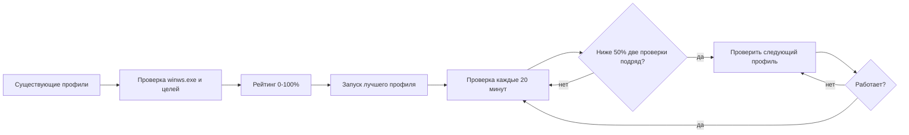
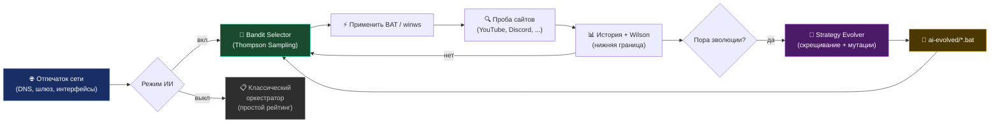
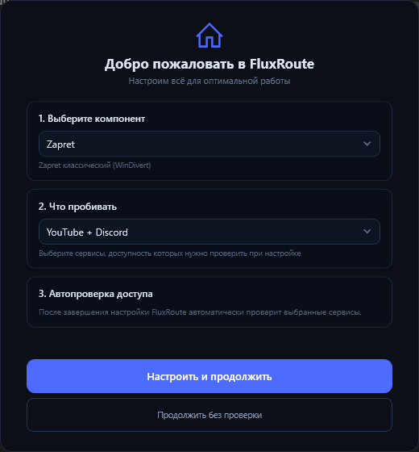
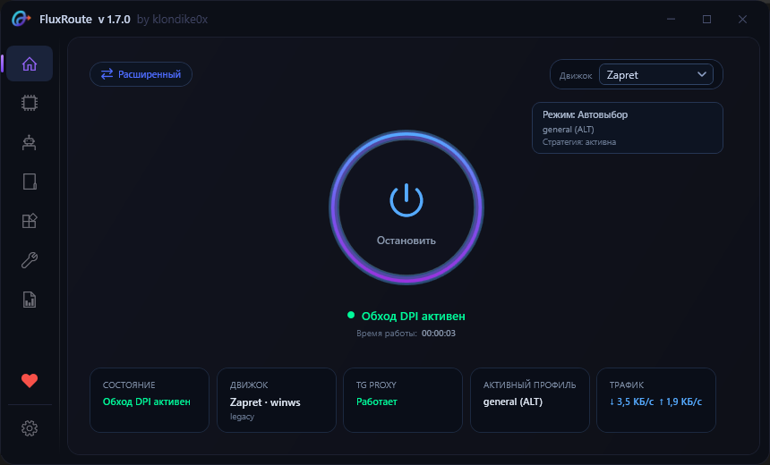
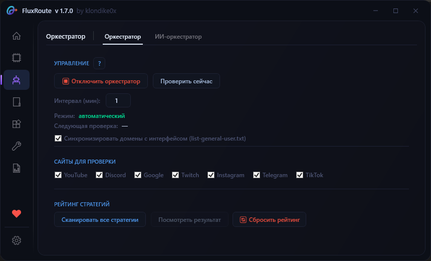
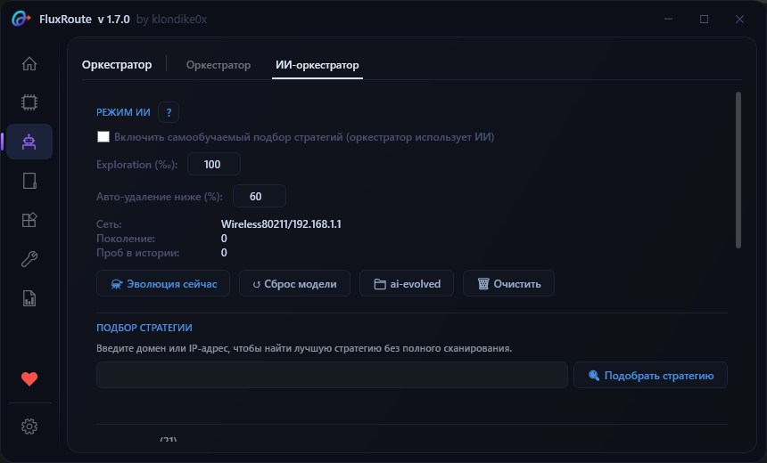
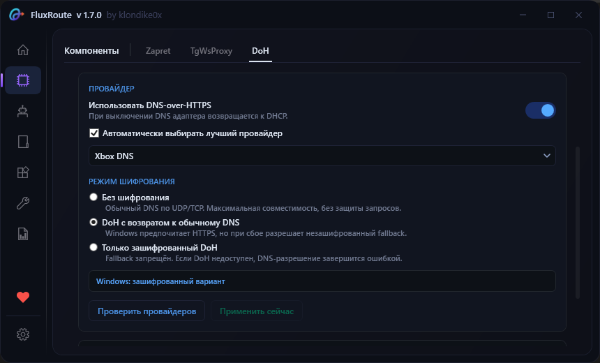
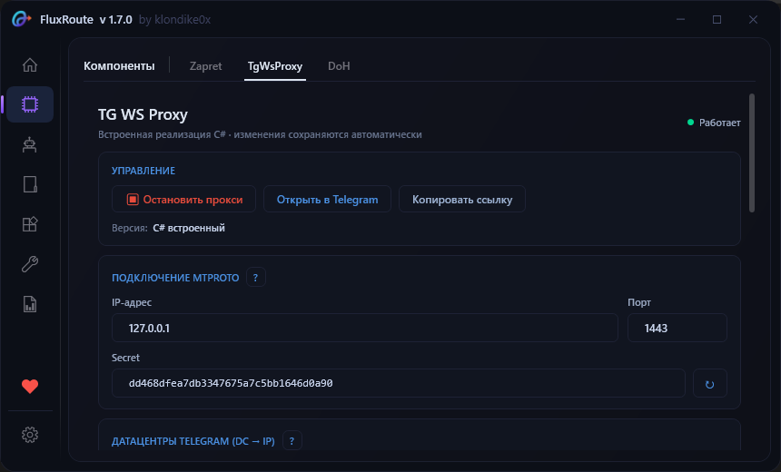

<div align="center">

<picture>
    <source media="(prefers-color-scheme: dark)" srcset="./assets/FluxRoute-white.svg">
    <source media="(prefers-color-scheme: light)" srcset="./assets/FluxRoute-dark.svg">
    
</picture>

# [FluxRoute Desktop](https://github.com/klondike0x/FluxRoute)

**Language:** 🇷🇺 Русский | [🇬🇧 English](README.en.md)

### Windows GUI с **самообучающимся ИИ-оркестратором** для zapret-профилей Flowseal

⭐️ **Поставьте звезду этому репозиторию — это лучшая бесплатная поддержка проекта!**

<!-- GitHub badge -->
[](https://donatr.ee/klondike0x)

**Автор:** [klondike0x](https://github.com/klondike0x) · [📚 Документация](docs/index.md) · [📥 Релизы](https://github.com/klondike0x/FluxRoute/releases) · [🐛 Issues](https://github.com/klondike0x/FluxRoute/issues) · [💬 Discussions](https://github.com/klondike0x/FluxRoute/discussions)

<p align="center">
    <a href="https://github.com/klondike0x/FluxRoute"></a>
    <a href="https://github.com/klondike0x/FluxRoute"></a>
    <a href="https://github.com/klondike0x/FluxRoute/releases"></a>
    <a href="https://github.com/klondike0x/FluxRoute/releases"></a>
    <a href="https://github.com/klondike0x/FluxRoute/actions/workflows/release.yml"></a>
    <a href="https://dotnet.microsoft.com/"></a>
    <a href="./LICENSE"></a>
</p>

</div>

---

> [!IMPORTANT]
> **Это оригинальный репозиторий FluxRoute Desktop.**
>
> Все производные проекты (форки) основаны на этом коде. GitHub автоматически помечает их надписью `forked from klondike0x/FluxRoute`.

> [!CAUTION]
> ### ⚠️ Осторожно: неавторизованные копии
>
> **Единственный официальный источник FluxRoute — [этот репозиторий](https://github.com/klondike0x/FluxRoute).**
>
> Если вы скачали программу из другого места, будьте осторожны. Неавторизованные копии могут содержать:
> - ❌ Устаревший код (без актуальных исправлений безопасности)
> - ❌ Вредоносные модификации или скрытую телеметрию
> - ❌ Нарушение лицензии GPL-3.0 (удаление атрибуции)
> - ❌ Нестабильные или непроверенные версии
>
> **Как защитить себя:**
> - ✅ Всегда проверяйте источник: `github.com/klondike0x/FluxRoute`
> - ✅ Скачивайте только из официальных релизов с зелёной галочкой `Verified`
> - ✅ Если встретили форк без явной атрибуции оригинала — сообщите через [GitHub DMCA](https://github.com/contact/report-abuse)
>
> Оригинальный FluxRoute **не собирает телеметрию** и **не содержит вредоносного кода**.

**FluxRoute Desktop** — современная GUI-оболочка для управления профилями [`Flowseal/zapret-discord-youtube`](https://github.com/Flowseal/zapret-discord-youtube) с уникальным **ИИ-оркестратором** на основе Thompson Sampling и генетической эволюции стратегий.

Запускайте, обновляйте и переключайте профили в одном окне — без ручного редактирования BAT-файлов.

> 🌍 **Примечание:** FluxRoute является частью экосистемы **zapret** — набора инструментов для обхода DPI (Deep Packet Inspection), который в основном используется в странах СНГ для доступа к заблокированным сервисам, таким как YouTube, Discord, Instagram и Telegram. Основное сообщество русскоязычное, но сам инструмент работает везде, где применяется DPI-фильтрация.

## 📚 Содержание

- [Возможности](#-возможности)
- [Чем FluxRoute отличается от других GUI](#-чем-fluxroute-отличается-от-других-gui)
- [Быстрый старт](#-быстрый-старт)
- [Оркестратор](#-оркестратор)
- [ИИ-оркестратор](#-ии-оркестратор)
- [Auto-Tune](#-auto-tune)
- [Моды](#-моды)
- [Интерфейс](#-интерфейс)
- [Решение проблем](#-решение-проблем)
- [WinDivert и антивирусы](#-windivert-и-антивирусы)
- [Безопасность](#-безопасность)
- [Экосистема](#-экосистема)
- [Для разработчиков](#-для-разработчиков)
- [Авторские права и условия использования](#-авторские-права-и-условия-использования)
- [Благодарности](#-благодарности)
- [Лицензия](#-лицензия)

---

## ✨ Возможности

### 🧠 Интеллект и автоматизация

| Фича                            | Описание                                                                                    |
| ------------------------------- | ------------------------------------------------------------------------------------------- |
| 🎯 **ИИ-оркестратор**           | Thompson Sampling для самообучаемого подбора стратегий под вашу сеть                        |
| 🧬 **Генетическая эволюция**    | Скрещивание лучших стратегий + мутации параметров zapret → новые BAT в `engine/ai-evolved/` |
| 🌐 **Network Fingerprint**      | Адаптация ИИ-политики под каждую сеть (Wi-Fi ↔ Ethernet, разные DNS)                        |
| 📊 **Классический оркестратор** | Сканирование всех профилей, рейтинг 0-100%, автопереключение на лучший при сбое             |
| ⚙️ **Auto-Tune**                | Автоматический подбор оптимальной комбинации IPSet × GameFilter                             |
| 🎮 **Процесс-триггеры**         | Автопереключение пресетов при запуске игр/приложений (например, `rocketleague.exe`)         |

### 🔌 Интеграции

| Фича                             | Описание                                                                           |
| -------------------------------- | ---------------------------------------------------------------------------------- |
| 📡 **TG WS Proxy**               | Встроенная C#-реализация Telegram WebSocket-прокси, не требует Python или отдельной установки |
| 🔄 **Автообновление engine/**    | Проверка новых релизов Flowseal через GitHub Releases (Atom feed, без API-лимитов) |
| 🆙 **Автообновление приложения** | Скачивание и атомарная установка новых версий FluxRoute с SHA-256 верификацией     |
| 🌍 **Менеджер доменов**          | Добавление своих сайтов и исключений для проверки оркестратором через UI           |

### 🎨 Интерфейс

| Фича                                   | Описание                                                                      |
| -------------------------------------- | ----------------------------------------------------------------------------- |
| 💎 **Компактный UI**                   | Одна кнопка Start/Stop, статус и логи всегда на виду — без перегруженных меню |
| 🖥 **Работа в трее**                   | Сворачивание в трей с balloon-уведомлениями о статусе                         |
| 🛡 **Скрытый запуск**                  | BAT-файлы и `winws.exe` работают в фоне без консольных окон                   |
| 🚀 **Автозапуск с Windows**            | Регистрация в реестре (`HKCU\...\Run`) с флагом `--autostart`                 |
| ⚡ **Автозапуск профиля**         | Автоматический запуск последнего профиля при старте FluxRoute                 |

### 🛡️ Безопасность

| Фича                                | Описание                                                                      |
| ----------------------------------- | ----------------------------------------------------------------------------- |
| 🔒 **GitHub Actions**               | Прозрачная CI/CD-сборка — каждый релиз собирается автоматически из исходников |
| ✅ **SHA-256 верификация**          | Хеши релизов логируются для проверки целостности скачанных файлов             |
| ✍️ **GPG-подпись релизов**          | Манифест SHA-256 подписывается отдельным ключом релиза                       |
| 🔐 **Immutable Releases**            | Опубликованные файлы и Git-тег нельзя изменить или подменить                  |
| 🧾 **Build provenance**              | GitHub attestation связывает артефакты с workflow и коммитом                   |
| 🔄 **Атомарные обновления**         | Staging → backup → rollback при ошибках (никаких "поломанных" установок)      |
| 👮 **Проверка прав администратора** | UAC elevation prompt при запуске + понятные сообщения об ошибках              |

### 🔧 Диагностика

| Фича                           | Описание                                                                     |
| ------------------------------ | ---------------------------------------------------------------------------- |
| 📊 **Расширенная диагностика** | Проверка WinDivert, BFE, TCP timestamps, VPN, AdGuard, DNS, провайдера       |
| 💾 **Диагностический бандл**   | Экспорт ZIP со всеми логами, настройками и системной информацией для отладки |
| 📋 **Логи в реальном времени** | Вкладка "Логи" с фильтрацией, экспортом и историей                           |
| 🌐 **Проверка доступности**    | Тест YouTube, Discord, Google, Twitch, Instagram, Telegram и других сайтов   |

### 🎨 Экосистема

| Фича                         | Описание                                                |
| ---------------------------- | ------------------------------------------------------- |
| 📦 **Portable**              | Работает из любой папки без установки                   |
| 🧪 **Unit-тесты**            | Покрытие для bandit, evolver, parser, fingerprint       |
| 📖 **Открытый исходный код** | GPL-3.0 — каждый может проверить, что делает приложение |
| 🚫 **Без телеметрии**        | FluxRoute не собирает данные пользователей              |

---

## 🆚 Чем FluxRoute отличается от других GUI

FluxRoute — **единственный** GUI с полноценной ИИ-подсистемой:

| Категория | FluxRoute | Zapret-Hub | Zapret-GUI | Zapret2 GUI | ZapretControl |
|---|:---:|:---:|:---:|:---:|:---:|
| 🧠 ИИ-оркестратор (Thompson Sampling) | ✅ | ❌ | ❌ | ❌ | ❌ |
| 🔄 Оркестратор (автоперебор) | ✅ | ✅ | ❌ | ✅ | ❌ |
| 🧬 Генетическая эволюция стратегий | ✅ | ❌ | ❌ | ❌ | ❌ |
| 🎮 Process-triggers (авто по .exe) | ✅ | ✅ | ❌ | ❌ | ❌ |
| ⚙️ Auto-Tune (IPSet × GameFilter) | ✅ | ✅ | ❌ | ❌ | ❌ |
| 📡 TG WS Proxy встроенный | ✅ | ✅ | ✅ | ❌ | ❌ |
| 🤖 AI DNS / DoH-провайдеры (Xbox, COMSS, dns.malw.link) | ✅ | ✅ | ✅ | ✅ | ❌ |
| 💬 Разблокировка Telegram Desktop | ✅ | ✅ | ✅ | ✅ | ❌ |
| 📚 80+ стратегий из коробки | ❌ | ❌ | ❌ | ✅ | ❌ |
| 🎨 Темы (5+) и многоязычность | ❌ | ✅ | ✅ | ❌ | ❌ |
| 📦 Portable + установщик | ✅ | ✅ | ⚠️ | ⚠️ | ⚠️ |
| 🔒 GitHub Actions (прозрачная сборка) | ✅ | ✅ | ❌ | ✅ | ✅ |
| 🔄 Атомарные обновления engine | ✅ | ⚠️ | ✅ | ❌ | ❌ |

> **Легенда:** ✅ = полностью реализовано · ⚠️ = частично / с ограничениями · ❌ = отсутствует

> **Главное отличие:** FluxRoute — единственный проект, где ИИ **сам подбирает и эволюционирует** стратегии под вашу сеть через Thompson Sampling и генетический алгоритм. Сборка полностью прозрачная через GitHub Actions — любой может проверить, что именно попадает в релиз.

---

## 🚀 Быстрый старт

### Требования

Полная документация: [📚 открыть документацию](docs/index.md).

- **Windows 10/11 x64**
- **Права администратора** (для работы `winws.exe` и WinDivert)

> **Быстрый путь для большинства пользователей:** скачайте последний релиз, установите или распакуйте его, запустите FluxRoute.exe от имени администратора и пройдите OnBoard. Выберите сервисы для проверки и нажмите «Настроить и продолжить» — FluxRoute проверит стратегии и запустит лучшую.

### Установка

1. Скачайте последний релиз: [**Releases**](https://github.com/klondike0x/FluxRoute/releases)
2. Для portable-версии распакуйте ZIP в любую папку (например, `C:\FluxRoute\`) или запустите установщик.
3. Запустите `FluxRoute.exe` **от имени администратора**.
4. Если `engine/` отсутствует, дождитесь его автоматической загрузки с Flowseal и перезапустите FluxRoute.
5. В OnBoard выберите, что проверять: YouTube, Discord или оба сервиса.
6. Нажмите **«Настроить и продолжить»** для проверки стратегий или **«Продолжить без проверки»**, чтобы перейти к программе без первичного сканирования.

### Первый запуск с ИИ

1. Обновите `engine/` на вкладке **Обновления**
2. Включите **режим ИИ** на вкладке **ИИ**
3. Запустите **оркестратор** на вкладке **Оркестратор**
4. Готово — ИИ автоматически подберёт лучшую стратегию под вашу сеть

## 🎛️ Оркестратор

Обычный оркестратор — это автоматический подбор лучшего профиля из уже существующих стратегий FluxRoute. Он работает детерминированно: не обучается и не создаёт новые стратегии, а проверяет доступные профили, строит рейтинг и следит за текущим соединением.

### Как он работает

1. **Сканирование** — по очереди запускает каждый профиль и проверяет состояние winws.exe и доступность выбранных целей.
2. **Рейтинг** — каждой стратегии присваивается оценка от 0 до 100%.
3. **Запуск** — после сканирования запускается профиль с наивысшим положительным рейтингом.
4. **Мониторинг** — текущий профиль повторно проверяется через заданный интервал (по умолчанию каждые 20 минут).
5. **Переключение** — если профиль получает результат ниже 50% в двух проверках подряд, оркестратор проверяет следующие профили по рейтингу и переключается на первый рабочий.

### Из чего складывается рейтинг

Максимум — 100 баллов:

- **20 баллов** — процесс winws.exe запущен.
- **15 баллов** — процесс стабилен после запуска.
- **До 55 баллов** — доля успешных проверок целевых сайтов.
- **До 10 баллов** — бонус за низкую среднюю задержку.
- Если все проверки неудачны или процесс нестабилен, применяются дополнительные ограничения и штрафы.

В список целей входят встроенные сайты (YouTube, Discord, Google, Twitch, Instagram и Telegram), а также пользовательские цели, добавленные через настройки. Профили с рейтингом 0% исключаются из обычного выбора.

### Схема работы



> Обычный оркестратор использует только профили, которые уже есть в engine. Для самообучаемого выбора, Wilson score и эволюции стратегий используется отдельный [ИИ-оркестратор](#-ии-оркестратор).

---

## 🧠 ИИ-оркестратор

Уникальная подсистема `FluxRoute.AI`, которой нет в других GUI:

| Компонент               | Назначение                                                                 |
| ----------------------- | -------------------------------------------------------------------------- |
| **Strategy Genome**     | Типизированное представление стратегии (фильтры, desync, split, fake TLS)  |
| **Bandit Selector**     | Выбор стратегии через Thompson Sampling с настраиваемым exploration        |
| **Strategy Evolver**    | Скрещивание лучших геномов по нижней границе Wilson; мутации параметров    |
| **Network Fingerprint** | Отпечаток сети (DNS, шлюз, интерфейсы) — отдельная политика на каждую сеть |
| **AiHistoryStore**      | Журнал проб в `fluxroute-ai-history.jsonl`                                 |
| **AiStrategyRegistry**  | Реестр геномов, bandit-состояние, счётчик поколений                        |
| **BatMaterializer**     | Запись эволюционированных стратегий в `engine/ai-evolved/*.bat`            |

### Как работает ИИ-оркестратор



### Цикл работы

1. 🌐 **Отпечаток сети** — фиксируем DNS, шлюз, интерфейсы
2. 🎰 **Bandit Selector** — выбираем стратегию через Thompson Sampling
3. ⚡ **Применяем BAT** — запускаем `winws.exe` с параметрами стратегии
4. 🔍 **Проба сайтов** — проверяем доступность YouTube, Discord и др.
5. 📊 **История + Wilson** — обновляем статистику успешности
6. 🧬 **Эволюция** — периодически скрещиваем лучшие стратегии
7. 📁 **`ai-evolved/`** — новые BAT-файлы сохраняются автоматически

---

## ⚙️ Auto-Tune

**Auto-Tune** — утилита для автоматического подбора оптимальной комбинации **IPSet** × **GameFilter** под вашу сеть.

### Как это работает

1. Программа перебирает 12 комбинаций режимов IPSet (`loaded`, `none`, `any`) и GameFilter (`TCP и UDP`, `TCP`, `UDP`, `Выкл`).
2. Для каждой комбинации на 4 секунды применяются настройки и запускается проверка доступности целей (YouTube, Discord, Google и др.) через HTTP и ping.
3. По результатам проверки каждая комбинация получает **composite score** (см. `CompositeScore` в `AutoTuneResult.cs`):
   - **60%** — доля успешных проверок (`SuccessRate`)
   - **30%** — средняя задержка (чем ниже, тем лучше, до 2000 мс)
   - **10%** — стабильность (разброс между min/max latency)
4. Комбинация с максимальным `CompositeScore` предлагается как лучшая.

> Формула расчёта: `AutoTuneResult.CalculateCompositeScore()` в `FluxRoute.Core/Models/AutoTuneResult.cs`.

### Где найти

Auto-Tune доступен на вкладке **«Сервис»** → кнопка **«🔍 Подобрать настройки»**. Результаты отображаются в оверлее с прогрессом, логом проверок и предложением применить лучшую комбинацию.

---

## 📦 Моды

FluxRoute поддерживает пользовательские моды — внешние скрипты и конфиги, которые можно включать и выключать во вкладке **«Модификации»**.

Подробная инструкция по структуре `manifest.json`, скриптам, зависимостям и API: [docs/mods.md](docs/mods.md).

---

## 📸 Интерфейс

<table>
<tr>
<td><br/><sub><b>OnBoard первого запуска</b> — выбор сервисов и запуск первичной проверки</sub></td>
<td><br/><sub><b>Главное окно</b> — управление защитой и текущим профилем</sub></td>
</tr>
<tr>
<td><br/><sub><b>Оркестратор</b> — проверка и рейтинг стратегий</sub></td>
<td><br/><sub><b>ИИ-оркестратор</b> — самообучение и эволюция стратегий</sub></td>
</tr>
<tr>
<td><br/><sub><b>DNS-over-HTTPS</b> — выбор и применение DNS-провайдера</sub></td>
<td><br/><sub><b>TG WS Proxy</b> — настройки встроенного Telegram-прокси</sub></td>
</tr>
</table>

---

## 🔧 Решение проблем

> [!IMPORTANT]
> При любых проблемах попробуйте:
>
> 1. Запустить от имени **администратора**
> 2. Обновить `engine/` на вкладке **Обновления**
> 3. Запустить **Сканировать все профили** на вкладке **Оркестратор**
> 4. Включить **Auto-Tune** на вкладке **Сервис**

### ❌ Профиль не работает (0%)

1. Убедитесь, что **GameFilter** = `TCP и UDP`
2. **IPSet Mode** = `loaded`
3. Запустите **Auto-Tune** на вкладке **Сервис**
4. Проверьте, что стратегия не отключена в ИИ-режиме (галочка в списке на вкладке **ИИ**)
5. Запустите расширенную диагностику (вкладка **Диагностика** → **Запустить диагностику**)

### ❌ Порт TG WS Proxy занят

```cmd
netstat -ano | findstr :1443
taskkill /PID <число> /F
```

> Если не помогает – перезагрузите компьютер.

---

## ⚠️ WinDivert и антивирусы

> [!WARNING]
> В проекте используется **WinDivert** — легитимный инструмент для перехвата трафика, необходимый для работы zapret.
>
> Сам по себе он **не является вирусом**, но антивирусы могут классифицировать его как `Not-a-virus:RiskTool.Multi.WinDivert` или `HackTool`.

**Что делать:**

- Добавьте папку FluxRoute в **исключения антивируса**
- Отключите детект **PUA** (потенциально нежелательных приложений)
- В Kaspersky: снимите галочку _"Обнаруживать легальные приложения, которые злоумышленники часто используют"_

---

## 🔒 Безопасность

- ✅ **GitHub Actions** — все релизы собираются автоматически, прозрачно
- ✅ **SHA-256 хеши** — каждая загрузка верифицируется в логах
- ✅ **GPG-подписи и immutable-релизы** — опубликованные файлы нельзя заменить незаметно
- ✅ **Build provenance** — артефакты связаны с конкретным workflow и коммитом
- ✅ **Открытый исходный код** — каждый может проверить, что делает приложение
- ✅ **Нет телеметрии** — FluxRoute не собирает данные пользователей
- ✅ **Портативный** — не требует установки, работает из папки
- ✅ **Атомарные обновления** — staging → backup → rollback при ошибках

> [!TIP]
> Обновления приложения всегда приходят только с официального репозитория `klondike0x/FluxRoute` — URL зашит в `AppUpdaterService`. Это гарантирует, что даже пользователи форков в итоге получают оригинальную версию.
>
> Тип обновления выбирается автоматически: установленная через installer версия получает новый installer, а Portable-версия обновляется через portable ZIP. Пользовательские настройки при этом сохраняются.

---

## 🌳 Экосистема

FluxRoute построен на экосистеме open-source проектов:

- **[WinDivert](https://github.com/basil00/WinDivert)** — низкоуровневая Windows-основа
- **[bol-van/zapret](https://github.com/bol-van/zapret)** — оригинальный проект
- **[bol-van/zapret-win-bundle](https://github.com/bol-van/zapret-win-bundle)** — Windows-бандл с `winws.exe`
- **[Flowseal/zapret-discord-youtube](https://github.com/Flowseal/zapret-discord-youtube)** — основа `engine/`, используемая в FluxRoute
- **[Flowseal/tg-ws-proxy](https://github.com/Flowseal/tg-ws-proxy)** — Telegram WebSocket прокси

---

## 🛠 Для разработчиков

### Требования

- .NET 10 SDK
- Visual Studio 2022/2026 или JetBrains Rider

### Сборка из исходников

```bash
git clone https://github.com/klondike0x/FluxRoute.git
cd FluxRoute
dotnet build
dotnet run --project FluxRoute
```

### Структура проекта

```
FluxRoute/
├── FluxRoute/              — UI (WPF, Views, ViewModels, вкладка «ИИ»)
├── FluxRoute.Core/         — Логика (Оркестратор, Проверка связи, Модели)
├── FluxRoute.AI/           — ИИ-движок (bandit, evolver, fingerprint, registry)
├── FluxRoute.Core.Tests/   — Unit-тесты (bandit, evolver, parser, fingerprint)
├── FluxRoute.Updater/      — Автообновление engine/ с GitHub
└── engine/                 — Скрипты Flowseal (скачиваются автоматически)
    └── ai-evolved/         — BAT-стратегии, созданные эволюцией
```

### Вклад в проект

1. Форкните репозиторий
2. Создайте ветку: `git checkout -b feature/my-feature`
3. Сделайте коммит: `git commit -m "feat: add my feature"`
4. Запушьте: `git push origin feature/my-feature`
5. Откройте **Pull Request**

---

## ⚖️ Авторские права и условия использования

> [!CAUTION]
> ### 📜 ОБЯЗАТЕЛЬНО К ПРОЧТЕНИЮ — особенно для авторов форков
>
> Использование этого проекта означает согласие с условиями лицензии **GPL-3.0**.
> Нарушение условий лицензии влечёт автоматическое прекращение прав (§8 GPL-3.0).

<details>
<summary><b>🔍 Раскрыть — условия GPL-3.0</b></summary>
<br/>

Данное ПО распространяется под лицензией **GPL-3.0**.

- **GUI, ИИ-оркестратор и код автоматизации (FluxRoute):** © 2026 [klondike0x](https://github.com/klondike0x)
- **Сторонние компоненты:** [bol-van/zapret](https://github.com/bol-van/zapret), [basil00/WinDivert](https://github.com/basil00/WinDivert), [Flowseal](https://github.com/Flowseal)

### 🔴 Обязательные требования GPL-3.0

Любой автор форка или модификации **обязан соблюдать**:

#### 1. Атрибуция автора (GPL-3.0 §4, §5a)
В **верхней части README** должен быть блок:

```markdown
> **Оригинальный проект:** [klondike0x/FluxRoute](https://github.com/klondike0x/FluxRoute)
>
> Этот форк основан на FluxRoute Desktop и расширяет его возможности.
> Изменения внесены [автор] в [год].
```

#### 2. Сохранение лицензии (GPL-3.0 §4, §6)
Форк должен распространяться под той же лицензией GPL-3.0 с сохранением текста лицензии.

#### 3. Отказ от товарных знаков (GPL-3.0 §7e)
Название **"FluxRoute"** и логотип являются идентификаторами оригинального проекта.
- ✅ Допустимо: "Fork of FluxRoute" / "Based on FluxRoute"
- ❌ Недопустимо: "FluxRoute AI" / "FluxRoute Pro" / использование логотипа

### 💡 Рекомендации (не являются требованиями GPL)

- **Версионирование:** Рекомендуется следовать SemVer (не завышать версии)
- **Приватность:** FluxRoute не собирает данные пользователей. Рекомендуется следовать этому принципу
- **Прозрачность:** Не вводите пользователей в заблуждение относительно происхождения кода

### ⚖️ Юридические последствия нарушений

При нарушении условий GPL-3.0:
- 🔴 **Права автоматически прекращаются** (§8 GPL-3.0)
- 🔴 Будет подан **DMCA Takedown** в GitHub Trust & Safety
- 🔴 При размещении на других площадках — официальное письмо администрации
- 🔴 Репозиторий будет удалён

### 🤝 Открытость к сотрудничеству

Я уважаю сообщество Open Source и готов к сотрудничеству:
- ✅ Готов рассмотреть качественные наработки с авторством контрибьютора
- ✅ Всегда открыт к обсуждению идей
- ✅ Готов помочь с GitHub Actions и CI/CD

Pull Request'ы приветствуются!

</details>

Подробнее об авторских правах на сторонние компоненты см. в файле [NOTICE](NOTICE).

**Отказ от ответственности:** Программа предоставляется «как есть». Автор не несёт ответственности за последствия использования ПО. Используя FluxRoute, вы подтверждаете, что делаете это на свой страх и риск.

---

## 🙏 Благодарности

FluxRoute был вдохновлён и частично основан на UX- и продуктовых решениях следующих проектов:

### [Zapret Hub](https://github.com/goshkow/Zapret-Hub) by goshkow

Часть интерфейсных, UX- и продуктовых решений FluxRoute была вдохновлена **Zapret Hub**:

- **Auto-Tune** (подбор настроек IPSet × GameFilter) — концепция автоматического тестирования комбинаций
- **Интеграция TG WS Proxy** — объединение zapret и tg-ws-proxy в едином интерфейсе
- **Структура навигации** — левая боковая панель с плавными переходами между вкладками
- **Продуктовый подход** — единый центр управления zapret-сценариями без bat-файлов

Особая благодарность **goshkow** за открытость к сотрудничеству и консультации.

### Другие проекты, повлиявшие на FluxRoute

- **[Zapret-GUI](https://github.com/medvedeff-true/Zapret-GUI)** by medvedeff-true
- **[ZapretControl](https://github.com/Virenbar/ZapretControl)** by Virenbar
- **[zapret](https://github.com/youtubediscord/zapret)** by youtubediscord

---

## 📜 Лицензия

Проект распространяется по лицензии **GNU General Public License v3.0**.

Подробности — в файле [LICENSE](LICENSE).

**Для авторов форков:** обязательно ознакомьтесь с разделом [⚖️ Авторские права и условия использования](#%EF%B8%8F-авторские-права-и-условия-использования).

FluxRoute Desktop является **GUI-оболочкой** для проекта `Flowseal/zapret-discord-youtube`.
Все права на `zapret`, `winws.exe` и связанные с ними скрипты принадлежат их авторам.
Этот репозиторий не претендует на авторство оригинальной низкоуровневой сетевой части.

---

<div align="center">

**Сделано с ❤️ для сообщества** · Автор: [klondike0x](https://github.com/klondike0x) · [⭐ Поставить звезду](https://github.com/klondike0x/FluxRoute) · [🐛 Сообщить о баге](https://github.com/klondike0x/FluxRoute/issues) · [💬 Задать вопрос](https://github.com/klondike0x/FluxRoute/discussions)

</div>
